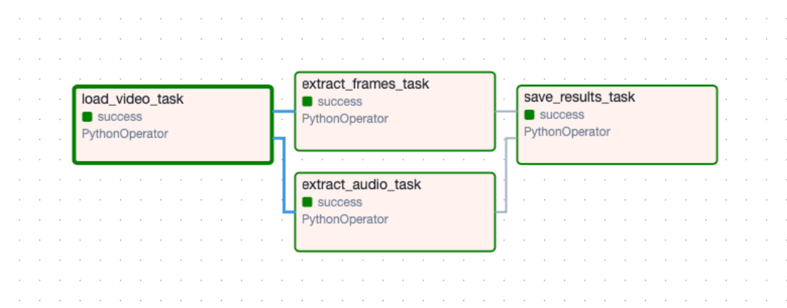

# Overview

The Data Pipeline module is a key component of the PitchQuest Multimodal system — an AI-powered platform for automated pitch analysis across speech, visual, and content modalities. This pipeline handles data ingestion, preprocessing, logging, anomaly detection, and orchestration of model inference workflows for multimodal inputs.

# Directory Structure
```
Data Pipeline/
├── Assets/
│   └── Screenshot 2025-10-19 at 23.2....png
│
├── Dag/
│   ├── outputs/
│   │   └── processing_summary.txt
│   └── src/
│
├── Data/
│   ├── video1.webm
│   └── video2.webm
│
├── logs/
│   └── pipeline/
│       ├── pipeline_20251027.log
│       ├── pipeline_20251028.log
│       ├── pipeline_errors_20251027.log
│       ├── pipeline_errors_20251028.log
│       └── test_log.py
│
├── scripts/
│   ├── main.py
│   ├── requirements.txt
│   └── vlm.py
│
├── store/
│   ├── video1_20251028_113709.txt
│   └── video1_20251028_121625.txt
│
├── tests/
│   ├── __init__.py
│   └── testTxtGeneration.py
│
├── .DS_Store
├── airflow_video.py
└── README.md
```

## Folders Overview:

- **Assets/** → Documentation images and screenshots.
- **Dag/** → Airflow DAG configurations and outputs.
- **Data/** → Raw pitch videos submitted by users.
- **logs/pipeline/** → Stores runtime logs, error traces, and log testing scripts.
- **scripts/** → Core pipeline logic, model invocation, and text generation.
- **store/** → Processed outputs and intermediate textual results.
- **tests/** → Unit and anomaly detection test scripts.
- **README.md** → Documentation for the data pipeline module.

# Current Model Configuration

## Models in Use

Due to cost and scalability considerations during early development, we are currently using smaller open-source models instead of API-based large models:

1. **Modality: Audio / Speech**
   - **Model Used:** openai/whisper
   - **Purpose:** Converts audio segments from pitch videos into text for NLP processing
   - **Reason for selection:** Highly accurate speech-to-text model, providing essential input for downstream language models

2. **Modality: Text/NLP**
   - **Model Used:** google/flan-5-large (As mentioned before we are using a smaller model right now due to cost issues)
   - **Purpose:** Performs content analysis, summarization, and structured text generation
   - **Reason for selection:** Provides moderate-level natural language understanding with low latency and minimal inference cost

3. **Modality: Vision/VLM**
   - **Model Used:** git-large-coco (As mentioned before we are using a smaller model right now due to cost issues)
   - **Purpose:** Extracts visual and contextual cues from frames for body language and slide analysis
   - **Reason for selection:** Offers decent captioning and multimodal understanding without requiring extensive GPU resources

**Note:** In order to extract text from audio, we employ OpenAI's Whisper model. This ensures precise transcription of user speech, which is then passed as structured input to our LLM for deeper semantic and contextual analysis. As the system matures, these models will be upgraded to finetuned, large-scale multimodal architectures integrated with automated retraining pipelines.

# Airflow Integration

## Current DAG Reference


We use an Airflow setup inspired by this [repository](https://github.com/msalmancodes/airflow_lab_3.git). 
The DAG temporarily orchestrates preprocessing, model inference, and result storage steps.

## Example Temporary DAG
```python
from airflow import DAG
from airflow.operators.python import PythonOperator
from datetime import datetime
from scripts.main import run_pipeline

default_args = {
    'owner': 'pitchquest',
    'start_date': datetime(2025, 10, 28),
    'retries': 1,
}

with DAG(
    'pitchquest_data_pipeline',
    default_args=default_args,
    schedule_interval='@daily',
    catchup=False,
    description='Temporary Airflow DAG for PitchQuest data pipeline',
) as dag:

    run_analysis = PythonOperator(
        task_id='run_data_pipeline',
        python_callable=run_pipeline,
    )

    run_analysis
```

## Proposed Full Pipeline (Upcoming)


# Logging and Monitoring

Logging and observability are central to the pipeline's reliability. All operations — from task start to model inference — are logged for performance tracking, debugging, and compliance.

The logging framework (configured via `config/logging_config.py`) uses a structured system to handle both standard and pipeline-specific events. Your `test_log.py` script demonstrates and validates the system's capabilities.

## Logging Highlights

- **Dynamic Import Handling:** Ensures correct path resolution across pipeline directories.
- **Component-Specific Logging:** Each module uses a `get_logger()` call tagged with a component name (e.g., "pipeline").
- **Pipeline Lifecycle Tracking:** The `PipelineLogger` object records events like pipeline start, end, and runtime duration.
- **Data Statistics Logging:** Records dataset metadata (record counts, missing values, etc.) to evaluate data health.
- **Granular Log Storage:** Logs are saved daily under `logs/pipeline/` with separate files for standard and error logs.

**Sample of logging actions captured:**


## Monitoring Tools:

- **Weights & Biases (W&B):** Model and experiment performance tracking.
- **Grafana + Prometheus:** Real-time operational metrics and error monitoring.
- **Evidently AI:** Drift detection and anomaly visualization.

# Anomaly Detection

Anomaly detection is integrated at both runtime and testing stages to maintain the integrity of the data pipeline.

During execution (`main.py`), the pipeline automatically validates each video's structure and format, detecting issues such as corrupted frames, empty audio channels, or missing metadata before triggering model inference. If inconsistencies are found, the pipeline halts and logs detailed diagnostic messages for debugging.

At the testing level, (the `tests/` directory) includes automated validation scripts that check generated text outputs for missing sections, malformed sentences, or empty responses. These tests ensure that each transformation step produces coherent and meaningful content before integration with the frontend or analytics modules.

All anomalies are logged and stored with timestamps, enabling root-cause analysis and continuous performance improvement.

# Bias Mitigation Strategy

## Data Bias Detection Using Data Slicing

### 1. Approach

Given the limited availability of user data during launch and the need to maintain strict privacy protections, the PitchQuest system adopts a two-pronged strategy for bias detection and monitoring:

- Literature-based documentation of known biases in the models deployed within the pipeline.
- Post-deployment monitoring through privacy-preserving technical feature analysis, avoiding the use of sensitive demographic attributes.

This hybrid method ensures early transparency regarding model limitations while enabling continuous, data-driven fairness evaluation after deployment.

### 2. Known Biases in Deployed Models

**Whisper (Speech-to-Text):**

Studies indicate that Whisper performs substantially better on American English than on other global accents. Native English speakers generally achieve higher transcription accuracy compared to non-native speakers (Graham & Roll, 2024). Furthermore, research has shown that the model experiences elevated error rates for Russian, Polish, Portuguese, and Turkish accents. Read or scripted speech tends to yield higher accuracy than conversational or spontaneous speech (Qxf2, 2023; HuggingFace, 2024).

**Large Language Models (GPT-4o mini / Claude):**

LLMs are known to internalize and reproduce social and cultural biases from their pretraining corpora (Gallegos et al., 2024). They often manifest gender stereotypes and racial bias despite appearing neutral. Empirical analyses have also identified a position bias, where LLMs overweight information at the beginnings or ends of documents while neglecting the central content (MIT, 2025). Even when explicitly optimized for fairness, these models may retain implicit biases and biased associations (PNAS, 2025).

**SmolVLM (Vision-Language Model):**

The SmolVLM model exhibits a strong dependency on memorized visual priors rather than on genuine image understanding. It achieves approximately 17% accuracy on modified visual elements compared to 100% accuracy on unaltered inputs (Vo et al., 2025). Additionally, it inherits gender and racial biases from its training data and demonstrates a marked preference for Western design aesthetics (Fraser & Kiritchenko, 2024).

### 3. Post-Deployment Monitoring

To identify bias manifestations in real-world usage, PitchQuest implements feature slicing — a privacy-preserving monitoring approach that relies solely on technical attributes extracted automatically from input data.

The system tracks model performance across various feature categories, including video quality, audio quality, speech characteristics, and content structure. Specifically, it examines parameters such as resolution, lighting, frame stability, signal-to-noise ratio, background noise, speech pace, pause frequency, slide density, and overall video duration. These observable variables serve as proxies for contextual and environmental diversity.

For each feature slice, several performance indicators are continuously monitored, including model confidence scores (across Whisper, LLM, and SmolVLM components), processing latency, user satisfaction ratings, and the rate at which users manually correct outputs. Alerts are automatically triggered when any of the following conditions are met:

- A performance disparity exceeding 15% between feature slices.
- Average user satisfaction ratings dropping below 3.5 out of 5.
- Correction rates surpassing 30%.
- Average model confidence scores falling below 0.70.

This enables early detection of performance degradation or bias-related anomalies without requiring demographic data collection.

### 4. Mitigation Strategies

**At Launch:**

During the initial release, the system employs user-facing transparency and adaptive guidance mechanisms to mitigate bias-related issues. These include context-aware warnings (e.g., "Low lighting detected — visual analysis confidence may be reduced"), color-coded confidence indicators (green for >0.80, yellow for 0.60–0.80, red for <0.60), and pre-assessment feedback that recommends optimal recording conditions to users.

**Post-Deployment:**

Once operational, PitchQuest transitions to adaptive processing that dynamically adjusts inference behavior based on input quality. An active learning mechanism prioritizes retraining on samples with low confidence scores or high correction rates. Retraining is automatically triggered when 100 user feedback corrections are collected or when persistent performance gaps above 10% are detected. Monthly bias audits are conducted to assess fairness metrics, with summarized results published through transparent reporting mechanisms.

### 5. Limitations

The current approach operates under several constraints. Because demographic data is neither collected nor inferred, all monitored features act as indirect proxies rather than direct measures of representation. Moreover, the inference-only deployment environment restricts access to model internals, preventing parameter-level debiasing interventions. Finally, small sample sizes at launch limit the statistical robustness of bias estimates.

Planned improvements include the introduction of optional, privacy-protected demographic self-reporting, partnerships with diverse speaker and investor groups for validation testing, and the establishment of an independent external bias audit board responsible for transparency and fairness oversight. Future development will also incorporate intersectional analysis frameworks to capture multi-dimensional fairness metrics across modalities.

## 6. Output Format Details

Each processed video generates a structured text file containing:

1. **Metadata Section**
   - Original video filename
   - Processing timestamp
   - Transcription length metrics

2. **Question Context**
   - Interview question or prompt

3. **Transcription Section**
   - Complete speech-to-text conversion using Whisper
   - Preserves natural speech patterns and pauses

4. **AI Analysis Section**
   - Automated feedback generation
   - Scoring and recommendations
   - Strengths and improvement areas

These outputs are stored in the `store/` directory and serve as inputs for downstream analytics and user feedback modules.
**Sample Output in Report:**
**(A) Sample Output Report Format 1**


**(B) Sample Output in Report Format 2**


### References

- Fraser, K. & Kiritchenko, S. (2024). Examining gender and racial bias in large vision–language models. EACL 2024.
- Gallegos, I.O. et al. (2024). Bias and Fairness in Large Language Models: A Survey. Computational Linguistics, 50(3): 1097–1179.
- Graham, C. & Roll, N. (2024). Evaluating OpenAI's Whisper ASR. JASA Express Letters, 4(2): 025206.
- MIT News (2025). Unpacking the bias of large language models.
- PNAS (2025). Explicitly unbiased large language models still form biased associations.
- Vo, A. et al. (2025). Vision Language Models are Biased. arXiv:2505.23941.
