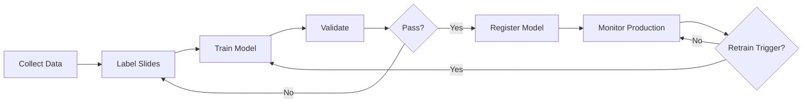

# Model Development Pipeline - PitchQuest Multimodal

Complete MLOps pipeline for finetuning SmolVLM-500M on pitch deck slide analysis.


## Overview

This pipeline enables automated training, validation, and deployment of a vision-language model that evaluates pitch deck slides across five quality dimensions:

-  **Clarity**: Message comprehension
-  **Design**: Visual appeal
-  **Data Visualization**: Chart effectiveness
-  **Readability**: Text legibility
-  **Content Quality**: Information value

## Project Structure
```
model_development_pipeline/
├── config/                    # Configuration files
│   ├── training_config.yaml  # Training hyperparameters & LoRA
│   ├── data_config.yaml      # Data sources & preprocessing
│   └── model_config.yaml     # Model specifications
│
├── data_pipeline/            # Data collection & labeling
│   ├── scrape_pitch_decks.py # Web scraping
│   ├── label_slides.py       # Gradio labeling interface
│   ├── dataset.py            # PyTorch dataset
│   └── __init__.py
│
├── training/                 # Model training
│   ├── finetune_smolvlm.py  # Main training script (LoRA)
│   ├── validate_model.py    # Validation pipeline
│   └── __init__.py
│
├── model_registry/           # Model versioning
│   ├── register_model.py    # HuggingFace registration
│   ├── version.json         # Version history
│   └── __init__.py
│
├── monitoring/              # Production monitoring
│   ├── drift_reports/       # Data drift detection
│   └── performance_metrics/ # Metrics tracking
│
├── scripts/                 # Utility scripts
│   └── check_retraining_trigger.py
│
└── .github/workflows/       # CI/CD automation
    └── retrain.yml          # Automated retraining
```

## Quick Start

### Prerequisites

- Python 3.10+
- 8GB RAM (16GB recommended)
- GPU with 16GB VRAM (or use Google Colab)
- [Weights & Biases](https://wandb.ai) account
- [HuggingFace](https://huggingface.co) account

### Installation
```bash
# 1. Navigate to project directory
cd model_development_pipeline

# 2. Create virtual environment
python -m venv venv

# 3. Activate virtual environment
# Windows PowerShell:
.\venv\Scripts\Activate.ps1
# Linux/Mac:
source venv/bin/activate

# 4. Install dependencies
pip install -r requirements.txt

# 5. Configure W&B
wandb login
# Enter your API key

# 6. Configure HuggingFace
huggingface-cli login
# Enter your token
```

### Configuration

Edit the configuration files with your credentials:

**`config/training_config.yaml`** (lines 39-40):
```yaml
wandb:
  entity: "your-wandb-username"  # CHANGE THIS
```

**`config/training_config.yaml`** (line 72):
```yaml
registry:
  huggingface_repo: "your-username/pitchquest-smolvlm"  # CHANGE THIS
```

## Pipeline Workflow

### Step 1: Data Collection (Day 1-2)

**Option A: Manual Upload (Recommended)**
```bash
# 1. Create upload directory
mkdir -p ../data/raw/manual_uploads

# 2. Add pitch deck slide images (JPG/PNG)
#    Sources: Y Combinator, SlideShare, your own decks

# 3. Process uploaded files
python data_pipeline/scrape_pitch_decks.py
```

**Goal:** Collect 500-1000 slides

### Step 2: Data Labeling (Day 2-4)
```bash
# Launch labeling interface
python data_pipeline/label_slides.py
```

- Opens at http://localhost:7860
- Rate each slide on 5 criteria (1-5 scale)
- Add optional notes
- Progress auto-saves to `../data/labeled/labels.json`

**Team Approach:** Each member labels 100-200 slides

### Step 3: Model Training (Day 5-6)
```bash
# Train model with LoRA
python training/finetune_smolvlm.py
```

**Training Details:**
- Uses LoRA (trains only 1% of parameters)
- 2-4 hours on T4 GPU (Google Colab free tier)
- Logs to Weights & Biases
- Checkpoints saved every 500 steps

**Monitor Training:**
- W&B dashboard: https://wandb.ai/your-entity/pitchquest-smolvlm
- Watch loss curves decrease
- Check eval metrics improve

### Step 4: Validation (Day 7)
```bash
# Validate trained model
python training/validate_model.py --model_path ./outputs
```

**Success Criteria:**
- Human agreement > 85%
- Mean Absolute Error < 0.6
- Within 1 point accuracy > 85%

**If validation fails:**
- Collect more labeled data
- Increase training epochs
- Check data quality

### Step 5: Model Registration (Day 7)
```bash
# Register to HuggingFace Hub
python model_registry/register_model.py \
  --model_path ./outputs \
  --validation_file ./outputs/validation_results.json \
  --token YOUR_HF_TOKEN
```

**Creates:**
- Version v1.0.0
- Model card with metrics
- Public HuggingFace repository

## Automated Retraining

The pipeline automatically retrains when:

1. **100+ user corrections** accumulated
2. **Weekly schedule** (every 7 days)
3. **Data drift** > 30%
4. **Performance drop** > 5%

### Manual Trigger
```bash
# Check if retraining needed
python scripts/check_retraining_trigger.py

# Trigger via GitHub Actions
gh workflow run retrain.yml
```

## Performance Targets

| Metric | Target | Current |
|--------|--------|---------|
| Human Agreement | > 85% | TBD |
| Processing Latency | < 2 min | TBD |
| Training Time | 2-4 hrs | TBD |
| Model Size | ~10 MB | ✅ |

## Configuration Options

### Training Hyperparameters

Edit `config/training_config.yaml`:
```yaml
training:
  num_train_epochs: 3              # Training epochs
  per_device_train_batch_size: 2   # Batch size
  learning_rate: 2.0e-4            # Learning rate

lora:
  r: 16                            # LoRA rank
  lora_alpha: 32                   # LoRA scaling
```

### Data Collection

Edit `config/data_config.yaml`:
```yaml
sources:
  manual:
    enabled: true
    path: "../data/raw/manual_uploads"
  
  slideshare:
    enabled: false  # Set true to enable scraping
```

## Troubleshooting

### CUDA Out of Memory
```yaml
# In config/training_config.yaml
per_device_train_batch_size: 1
gradient_accumulation_steps: 16
```

### Slow Training

- Use Google Colab with T4 GPU
- Enable gradient checkpointing
- Reduce batch size

### Low Validation Score

- Collect more diverse data
- Check labeling consistency
- Increase training epochs
- Review failure cases

### Module Import Errors
```bash
# Ensure virtual environment is activated
.\venv\Scripts\Activate.ps1  # Windows
source venv/bin/activate      # Linux/Mac

# Reinstall dependencies
pip install -r requirements.txt --upgrade
```

## Additional Resources

- [LoRA Paper](https://arxiv.org/abs/2106.09685)
- [SmolVLM Model](https://huggingface.co/HuggingFaceTB/SmolVLM-500M-Instruct)
- [Weights & Biases Docs](https://docs.wandb.ai/)
- [HuggingFace Hub](https://huggingface.co/docs/hub)

## Team

- **Harshita Shitut** 
- **Mohit Kakda** 
- **Muhammad Salman** 
- **Sachin Muttu Baraddi** 
- **Uttapreksha Patel**

## Development Workflow


## Security

- Never commit API keys or tokens
- Use `.env` files for secrets
- Add `.env` to `.gitignore`
- Use GitHub Secrets for CI/CD

## License

Apache 2.0 - Educational project for MLOps coursework

## Acknowledgments

- Anthropic Claude for development assistance
- HuggingFace for model hosting
- OpenAI for Whisper API
- Google for MediaPipe

## Contact

For issues or questions:
1. Check troubleshooting section
2. Review W&B logs
3. Open GitHub issue
4. Contact team members

---

